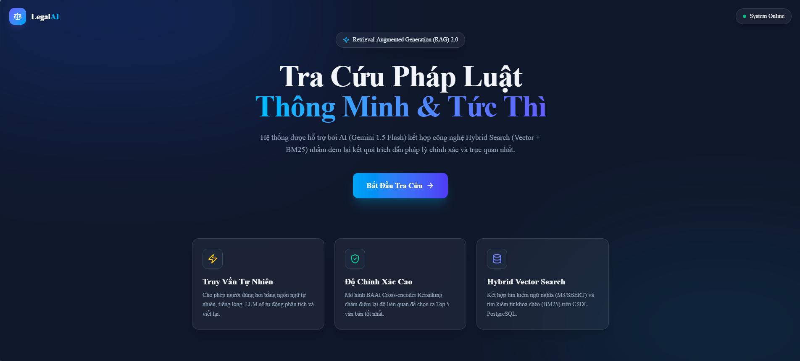
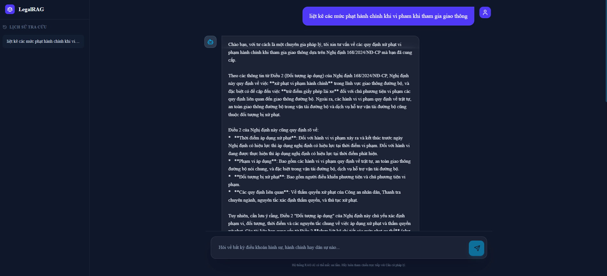
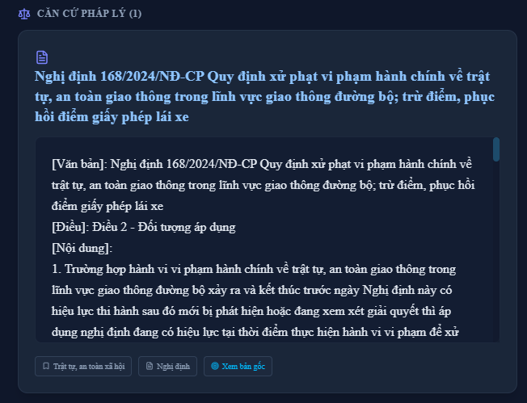

# RAG Legal Assistant (Hệ Thống RAG Tư Vấn Pháp Luật)

Đây là hệ thống Chatbot/trợ lý pháp luật sử dụng kiến trúc **Retrieval-Augmented Generation (RAG)**. 
**Xem video Demo chi tiết trên YouTube:** [Tại đây](https://youtu.be/QCBXms4HKZ0)

##  Kiến Trúc Hệ Thống


##  Các Công Cụ Và Công Nghệ Sử Dụng
Dự án được xây dựng dựa trên các công nghệ và công cụ hiện đại:
- **Ngôn ngữ lập trình**: Python, JavaScript/TypeScript.
- **Cơ sở dữ liệu Vector**: **PostgreSQL** kết hợp extension **`pgvector`** để lưu trữ và tính độ tương đồng của các biểu diễn vector (embeddings).
- **Backend Framework**: **FastAPI** cung cấp API tốc độ cao, xử lý văn bản, tạo embedding và tương tác trực tiếp với AI.
- **Mô Hình Biểu Diễn Vector (Embedding)**: Sử dụng **`keepitreal/vietnamese-sbert`** (Sentence-Transformers) chuyên dụng cho tiếng Việt để chuyển đổi văn bản thành vector.
- **Mô Hình Đánh Giá Trọng Số (Reranker)**: Sử dụng Cross-Encoder **`BAAI/bge-reranker-v2-m3`** để chấm điểm lại (rerank) mức độ liên quan của các tài liệu trước khi đưa vào LLM.
- **Mô Hình Ngôn Ngữ (LLM)**: Sử dụng **Google `gemini-2.5-flash`** cho 2 nhiện vụ: Viết lại truy vấn (Query Rewriting) và tổng hợp câu trả lời cuối cùng.
- **Frontend Framework**: **ReactJS** cùng với **Vite** để phát triển giao diện người dùng (UI) một cách mượt mà và trực quan.
- **Thu thập & Xử lý Dữ liệu**: Thư viện BeautifulSoup4 và Requests để thu thập dữ liệu (crawling), kết hợp thuật toán chunking tùy chỉnh theo cấu trúc Điều/Khoản của văn bản pháp luật.
- **Môi trường & Triển khai**: Mọi thứ được đóng gói (containerized) thông qua **Docker** và chạy bằng **Docker Compose**, bảo đảm dễ dàng tự động hóa quy trình cài đặt.

##  Giao Diện Ứng Dụng
Dưới đây là một số hình ảnh thực tế về giao diện của hệ thống:

<p align="center">
  
</p>
<p align="center">
  
</p>
<p align="center">
  
</p>

---

## Phần 1: Chuẩn Bị Dữ Liệu (Bắt Buộc Cho Lần Đầu Tiên)

Hệ thống cần có dữ liệu trước khi có thể hoạt động tư vấn. Nếu Database của bạn chưa có sẵn dữ liệu, hãy thực hiện lần lượt các bước sau:

**1. Thu thập dữ liệu (Crawling):**
Hệ thống sẽ tải toàn bộ văn bản pháp luật được khai báo trong file danh sách liên kết.

```bash
#Di chuyển vào thư mục `craw data`
cd craw data
pip install -r requirements.txt
python craw_data.py
```

**2. Phân đoạn dữ liệu (Chunking):**

```bash
cd vectorDB
pip install -r requirements.txt
cd chungking
python main.py
```
**3. Lưu trữ vào Database (Ingestion):**

```bash
cd vectorDB
# Khởi động cơ sở dữ liệu pgvector bằng Docker trước
docker-compose up -d

# Cài đặt thư viện và nạp dữ liệu vào Database
pip install -r requirements.txt
python ingest_data.py
```
---

## Phần 2: Khởi Chạy Hệ Thống RAG

### Cách 1: Chạy dự án bằng Docker (Khuyên dùng)
Phù hợp khi bạn muốn khởi chạy toàn bộ hệ thống bằng 1 lệnh duy nhất hoặc triển khai lên máy chủ.

Yêu cầu: Đã cài đặt Docker Desktop và đang mở chạy ngầm.

1. Bật phần mềm Docker Desktop.
2. Mở Terminal/CMD tại thư mục gốc của dự án.
3. Chạy lệnh:
   ```bash
   docker-compose up --build -d
   ```
4. Truy cập giao diện ứng dụng tại: http://localhost
(Backend tự động chạy ở cổng 8000 nội bộ và Frontend Nginx phục vụ ở cổng 80).
Lưu ý: Để dừng hệ thống: `docker-compose down`.

### Cách 2: Chạy dự án thủ công
Phù hợp khi đang viết code lập trình hoặc thao tác kiểm thử từng thành phần.

**2.1. Mở Cơ sở dữ liệu (VectorDB)**
Bắt buộc phải bật database bằng Docker.
```bash
# Di chuyển vào thư mục vectorDB 
cd vectorDB

# Bật database pgvector 
docker-compose up -d
```
(Lưu ý: Bạn cũng có thể dùng file `docker-compose.yml` ở thư mục gốc như Cách 1 để khởi động Database).

**2.2. Chạy Backend (Python/FastAPI)**
Mở một Terminal/CMD mới:
```bash
# Di chuyển vào thư mục backend
cd backend

# Cài đặt thư viện
pip install -r requirements.txt

# Khởi chạy Server (Nhớ cấu hình file .env có chứa GEMINI_API_KEY)
uvicorn main:app --reload --host 0.0.0.0 --port 8000
```
API của bạn sẽ chạy tại: http://localhost:8000. Bạn có thể xem tài liệu API tại http://localhost:8000/docs.

**2.3. Chạy Frontend (React/Vite)**
Mở tiếp một Terminal/CMD mới:
```bash
# Di chuyển vào thư mục frontend/rag_app
cd frontend/rag_app

# Cài đặt các gói thư viện Node
npm install

# Khởi chạy server phát triển giao diện
npm run dev
```
Giao diện Web sẽ xuất hiện tại đường dẫn hiển thị trên terminal (thường là http://localhost:5173).
